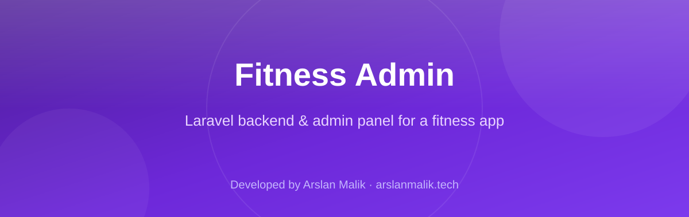

<p align="center">
  
</p>

<p align="center">
  
  
  
  
  
</p>

> **Developed by [Arslan Malik](https://github.com/arsalanmaalik461)**
> 📱 WhatsApp: [+92 300 8987448](https://wa.me/923008987448) · 🌐 Website: [arslanmalik.tech](https://arslanmalik.tech)

---

## 🌟 Executive Overview

**fitness-admin** is the backend and admin-panel codebase behind **MightyFitness**, a fitness application. Built on **Laravel 11** (PHP 8.2) with **MySQL**, it serves two jobs from one codebase: a full-featured web admin panel where staff manage every piece of fitness content, and a **Sanctum-authenticated REST API** that powers the mobile app — workouts, diets, user profiles, subscriptions, notifications and more.

The domain model is deep: over 40 Eloquent models cover exercises, workouts, workout types, workout days, body parts, equipment, levels, tags, diets, diet categories, assigned plans, class schedules, packages, subscriptions, payment gateways, products, blog posts, motivational quotes, user progress graphs and even a ChatGPT-powered Fit Bot. On the tooling side it ships with Yajra DataTables, Excel import/export, Spatie role/permission + media-library support, OneSignal push notifications, and a full localization/keyword system — everything a content-driven fitness product needs to run day to day.

---

## 📑 Table of Contents

- [✨ Key Features & Highlights](#-key-features--highlights)
- [🖥️ Feature Showcase](#️-feature-showcase)
- [🏗️ System Architecture](#️-system-architecture)
- [🚀 Quickstart & Installation Guide](#-quickstart--installation-guide)
- [📂 Project Structure](#-project-structure)
- [🛡️ Security & Notes](#️-security--notes)

---

## ✨ Key Features & Highlights

| Feature | Description |
| :--- | :--- |
| 🏋️ Fitness Content Management | 40+ Eloquent models and ~30 web controllers manage exercises, workouts, workout types, workout days, body parts, equipment, levels, tags and categories through a Bootstrap 5 admin UI. |
| 🥗 Diet & Nutrition Plans | Diets, diet categories, favourite diets and per-user assigned diets with an `AssignDiet`/`AssignWorkout` flow, all exposed to the mobile app via dedicated API endpoints. |
| 📱 Sanctum REST API | 24 API controllers (register, login, social/OTP login, profile, dashboard, workouts, diets, subscriptions, payment gateways, notifications, ChatGPT Fit Bot, game scores, user graphs…) consumed by the mobile client. |
| 💳 Subscriptions & Payments | Packages, subscriptions and configurable payment-gateway settings with subscription management endpoints for in-app monetization. |
| 🤖 ChatGPT Fit Bot | `ChatgptFitBot` model + API controller wiring AI-assisted fitness responses into the app experience. |
| 🔔 Push Notifications | OneSignal notification channel (`laravel-notification-channels/onesignal`) with a push-notification admin screen and resend tooling. |
| 🌍 Localization System | Language lists, version details and keyword management (`LanguageTable`, import/export of language keyword files) with downloadable templates. |
| 📊 Excel Import/Export | Maatwebsite/Laravel-Excel `Exports` and `Imports` for bulk data handling (e.g. language keywords). |
| 🛡️ Roles & Permissions | Spatie Laravel-Permission roles, granular permission screens and sub-admin management for staff access control. |
| 🖼️ Media Library | Spatie MediaLibrary integration for images attached to exercises, diets, products and other content. |
| 📈 Dashboards & Graphs | Admin dashboard plus per-user progress graphs (`UserGraph`, `users-graph` screen) and game score tracking. |
| 🗃️ Reference SQL Dumps | `mightyfitness.sql`, `alter-mightyfitness.sql` and `old-mightyfitness.sql` ship alongside migrations as reference data sets. |

---

## 🖥️ Feature Showcase

### 1. Content Studio — Workouts, Diets & Schedules

> *"The whole fitness catalogue, managed from one admin panel."*

- CRUD for exercises (with body part, equipment, level, tags), workouts, workout days and day-wise exercise assignment.
- Diets and diet categories with favourites and per-user assigned diet/workout plans.
- Class schedules and plans (`ClassSchedule`, `ClassSchedulePlan`) for gym-class style timetables.
- Motivational quotes, blog posts, product shop items and categories round out the content surface.

### 2. Plans & Monetization

> *"Packages, subscriptions and payment gateways — the revenue layer."*

- `Package` and `Subscription` models with subscription settings in the admin panel.
- Configurable payment gateways surfaced to the app through `PaymentGatewayController`.
- Subscription save/settings endpoints and user-facing subscription status handling.

### 3. Mobile API Layer

> *"One Sanctum-secured API feeds the entire app."*

- Auth: register, login, forget-password, social email login and social OTP login, all token-issued via Laravel Sanctum.
- Content feeds: workouts, diets, levels, tags, categories, equipment, body parts, class schedules, language tables.
- Engagement: dashboard detail, user graphs, game score data, push notifications, and the ChatGPT Fit Bot endpoint.
- ~62 API routes (GET/POST) organized in `routes/api.php`, split into public and `auth:sanctum` groups.

### 4. Admin Tooling — Localization, Roles & Data

> *"Built for a team, not just a developer."*

- Language keyword management with bulk import (`import-language-keyword`), per-locale file editing and downloadable list exports.
- Role/permission management with sub-admin accounts and a permission screen per staff type.
- Mobile-config screen, app settings, privacy-policy/terms editors, maintenance/lockscreen pages.
- DataTables-powered `ajax-list` endpoints across content screens for fast server-side listing.

---

## 🏗️ System Architecture

```mermaid
graph TD
    A[Mobile App<br/>(MightyFitness client)] -->|Sanctum tokens| B[REST API<br/>routes/api.php<br/>24 API controllers]
    C[Admin Panel<br/>Blade + Vue 2 + Bootstrap 5] -->|Session auth| D[Web Controllers<br/>routes/web.php<br/>~30 controllers]
    B --> E[Services & Traits<br/>Helpers · Notifications · Imports/Exports]
    D --> E
    E --> F[Eloquent Models<br/>40+ models<br/>Media · Permissions · Slugs]
    F --> G[(MySQL<br/>migrations + mightyfitness.sql)]
    E --> H[OneSignal<br/>Push notifications]
    E --> I[ChatGPT API<br/>Fit Bot]
    E --> J[Payment Gateways<br/>configured per settings]
    E --> K[Excel Import/Export<br/>language data & reports]
```

---

## 🚀 Quickstart & Installation Guide

### Prerequisites

- PHP **8.2+** with `mbstring`, `openssl`, `pdo_mysql` and other standard Laravel extensions
- Composer 2
- Node.js 16+ and npm (for Laravel Mix assets)
- MySQL 8 (or MariaDB); a reference data set ships as `mightyfitness.sql`

### Step-by-Step Installation

```bash
# 1. Clone and enter the project
git clone https://github.com/arsalanmaalik461/fitness-admin.git
cd fitness-admin

# 2. Install PHP dependencies
composer install

# 3. Configure the environment
cp .env.example .env
php artisan key:generate
# edit .env: DB_CONNECTION=mysql, DB_HOST, DB_DATABASE, DB_USERNAME, DB_PASSWORD

# 4. Build the database (choose ONE)
php artisan migrate --seed          # fresh schema via migrations
# OR import the reference dump:
mysql -u your_user -p your_database < mightyfitness.sql

# 5. Install frontend assets
npm install
npm run prod        # or: npm run dev / npm run watch during development

# 6. Link storage and serve
php artisan storage:link
php artisan serve   # → http://127.0.0.1:8000
```

Admin credentials are seeded by the project's seeders (check `database/seeders`); the API is served from `/api/*`.

---

## 📂 Project Structure

```
fitness-admin/
├── app/
│   ├── Console/            # Artisan commands
│   ├── DataTables/         # Yajra DataTables server-side listings
│   ├── Exports/ / Imports/ # Maatwebsite Excel export/import classes
│   ├── Helpers/            # helper.php (autoloaded)
│   ├── Http/
│   │   ├── Controllers/
│   │   │   ├── API/        # 24 mobile API controllers (Sanctum)
│   │   │   ├── Auth/       # Login / register / password flows
│   │   │   ├── Security/   # Lock screen, maintenance helpers
│   │   │   └── *.php       # ~30 web admin controllers
│   │   ├── Middleware/ · Requests/ · Resources/
│   ├── Models/             # 40+ Eloquent models
│   ├── Notifications/      # OneSignal push notifications
│   ├── Providers/ · Traits/ · View/
├── config/                 # Laravel config (incl. onesignal, medialibrary, permission)
├── database/
│   ├── migrations/         # Timestamped schema migrations
│   └── seeders/
├── public/                 # Web root (index.php, built assets)
├── resources/
│   ├── views/              # 124 Blade templates (dashboards, CRUD screens, layouts)
│   ├── js/ · sass/         # Vue 2 + Bootstrap 5 sources (Laravel Mix)
├── routes/
│   ├── api.php             # Mobile API (~62 routes)
│   ├── web.php             # Admin panel routes
│   └── auth.php · channels.php · console.php
├── mightyfitness.sql       # Reference MySQL data dump
├── alter-mightyfitness.sql / old-mightyfitness.sql  # Supplementary dumps
├── composer.json           # Laravel 11, Sanctum, Spatie, Yajra, Maatwebsite…
├── package.json            # Vue 2, Bootstrap 5, jQuery, DataTables, ApexCharts
├── webpack.mix.js
└── .env.example
```

---

## 🛡️ Security & Notes

- Mobile API access is token-based via **Laravel Sanctum**; sensitive routes live behind the `auth:sanctum` middleware group. Rotate tokens on logout/password change and keep `APP_KEY` secret.
- Staff access is governed by **Spatie Laravel-Permission** roles — give sub-admins only the modules they need.
- The bundled `*.sql` dumps are reference snapshots; review before importing and never import production dumps into a live database without a backup.
- Third-party services (OneSignal, ChatGPT, payment gateways) require real API keys in `.env` — the repo ships only the integration code, not credentials.
- This is a content-management backend: user data (profiles, progress graphs) is stored in MySQL — apply standard hardening (HTTPS, DB user least-privilege, queue workers for notifications) when deploying.

---

<p align="center">
  <b>Developed by <a href="https://github.com/arsalanmaalik461">Arslan Malik</a></b><br>
  📱 WhatsApp: <a href="https://wa.me/923008987448">+92 300 8987448</a> · 🌐 <a href="https://arslanmalik.tech">arslanmalik.tech</a>
</p>
